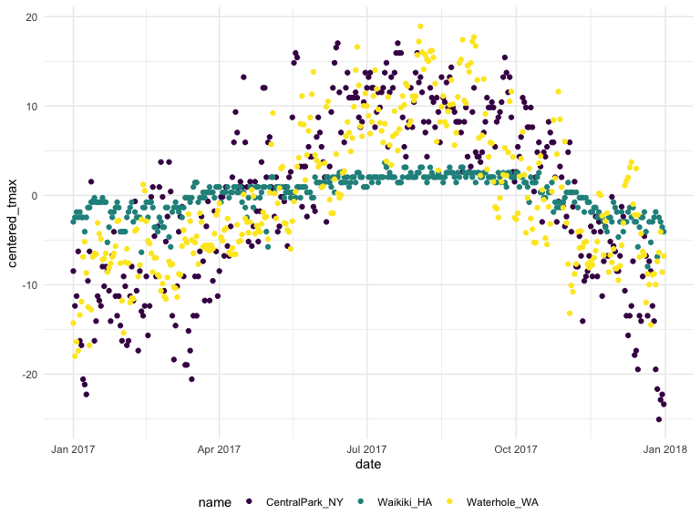

eda
================
Misbath Daouda
10/3/2019

``` r
library(tidyverse)
```

    ## ── Attaching packages ─────────────────────────────────────────────────────────────────────── tidyverse 1.2.1 ──

    ## ✔ ggplot2 3.2.0     ✔ purrr   0.3.2
    ## ✔ tibble  2.1.3     ✔ dplyr   0.8.3
    ## ✔ tidyr   1.0.0     ✔ stringr 1.4.0
    ## ✔ readr   1.3.1     ✔ forcats 0.4.0

    ## ── Conflicts ────────────────────────────────────────────────────────────────────────── tidyverse_conflicts() ──
    ## ✖ dplyr::filter() masks stats::filter()
    ## ✖ dplyr::lag()    masks stats::lag()

``` r
library(viridis)
```

    ## Loading required package: viridisLite

``` r
knitr::opts_chunk$set(
    echo = TRUE,
    warning = FALSE,
    fig.width = 8, 
  fig.height = 6,
  out.width = "90%"
)
options(
  ggplot2.continuous.colour = "viridis",
  ggplot2.continuous.fill = "viridis"
)
scale_colour_discrete = scale_colour_viridis_d
scale_fill_discrete = scale_fill_viridis_d
theme_set(theme_minimal() + theme(legend.position = "bottom"))
```

create the weather data
-----------------------

``` r
weather_df = 
  rnoaa::meteo_pull_monitors(c("USW00094728", "USC00519397", "USS0023B17S"),
                      var = c("PRCP", "TMIN", "TMAX"), 
                      date_min = "2017-01-01",
                      date_max = "2017-12-31") %>%
  mutate(
    name = recode(id, USW00094728 = "CentralPark_NY", 
                      USC00519397 = "Waikiki_HA",
                      USS0023B17S = "Waterhole_WA"),
    tmin = tmin / 10,
    tmax = tmax / 10,
    month = lubridate::floor_date(date, unit = "month")) %>%
  select(name, id, date, month, everything())
```

    ## Registered S3 method overwritten by 'crul':
    ##   method                 from
    ##   as.character.form_file httr

    ## Registered S3 method overwritten by 'hoardr':
    ##   method           from
    ##   print.cache_info httr

    ## file path:          /Users/misbath/Library/Caches/rnoaa/ghcnd/USW00094728.dly

    ## file last updated:  2019-09-26 10:25:42

    ## file min/max dates: 1869-01-01 / 2019-09-30

    ## file path:          /Users/misbath/Library/Caches/rnoaa/ghcnd/USC00519397.dly

    ## file last updated:  2019-09-26 10:25:53

    ## file min/max dates: 1965-01-01 / 2019-09-30

    ## file path:          /Users/misbath/Library/Caches/rnoaa/ghcnd/USS0023B17S.dly

    ## file last updated:  2019-09-26 10:25:58

    ## file min/max dates: 1999-09-01 / 2019-09-30

grouping and counting
---------------------

``` r
weather_df %>%
  group_by(name, month)
```

    ## # A tibble: 1,095 x 7
    ## # Groups:   name, month [36]
    ##    name           id          date       month       prcp  tmax  tmin
    ##    <chr>          <chr>       <date>     <date>     <dbl> <dbl> <dbl>
    ##  1 CentralPark_NY USW00094728 2017-01-01 2017-01-01     0   8.9   4.4
    ##  2 CentralPark_NY USW00094728 2017-01-02 2017-01-01    53   5     2.8
    ##  3 CentralPark_NY USW00094728 2017-01-03 2017-01-01   147   6.1   3.9
    ##  4 CentralPark_NY USW00094728 2017-01-04 2017-01-01     0  11.1   1.1
    ##  5 CentralPark_NY USW00094728 2017-01-05 2017-01-01     0   1.1  -2.7
    ##  6 CentralPark_NY USW00094728 2017-01-06 2017-01-01    13   0.6  -3.8
    ##  7 CentralPark_NY USW00094728 2017-01-07 2017-01-01    81  -3.2  -6.6
    ##  8 CentralPark_NY USW00094728 2017-01-08 2017-01-01     0  -3.8  -8.8
    ##  9 CentralPark_NY USW00094728 2017-01-09 2017-01-01     0  -4.9  -9.9
    ## 10 CentralPark_NY USW00094728 2017-01-10 2017-01-01     0   7.8  -6  
    ## # … with 1,085 more rows

``` r
weather_df %>%
  group_by(name, month) %>%
  summarize(
    n_obs = n(),
    n_unique = n_distinct(date))
```

    ## # A tibble: 36 x 4
    ## # Groups:   name [3]
    ##    name           month      n_obs n_unique
    ##    <chr>          <date>     <int>    <int>
    ##  1 CentralPark_NY 2017-01-01    31       31
    ##  2 CentralPark_NY 2017-02-01    28       28
    ##  3 CentralPark_NY 2017-03-01    31       31
    ##  4 CentralPark_NY 2017-04-01    30       30
    ##  5 CentralPark_NY 2017-05-01    31       31
    ##  6 CentralPark_NY 2017-06-01    30       30
    ##  7 CentralPark_NY 2017-07-01    31       31
    ##  8 CentralPark_NY 2017-08-01    31       31
    ##  9 CentralPark_NY 2017-09-01    30       30
    ## 10 CentralPark_NY 2017-10-01    31       31
    ## # … with 26 more rows

``` r
weather_df %>%
  count(name, month)
```

    ## # A tibble: 36 x 3
    ##    name           month          n
    ##    <chr>          <date>     <int>
    ##  1 CentralPark_NY 2017-01-01    31
    ##  2 CentralPark_NY 2017-02-01    28
    ##  3 CentralPark_NY 2017-03-01    31
    ##  4 CentralPark_NY 2017-04-01    30
    ##  5 CentralPark_NY 2017-05-01    31
    ##  6 CentralPark_NY 2017-06-01    30
    ##  7 CentralPark_NY 2017-07-01    31
    ##  8 CentralPark_NY 2017-08-01    31
    ##  9 CentralPark_NY 2017-09-01    30
    ## 10 CentralPark_NY 2017-10-01    31
    ## # … with 26 more rows

``` r
#if just want to count, can bypass group_by and summarize 
```

``` r
weather_df %>%
  pull(name) %>%
  table()
```

    ## .
    ## CentralPark_NY     Waikiki_HA   Waterhole_WA 
    ##            365            365            365

``` r
#table is not a dataframe, so can't manipulate afterwards 
```

Making a (nicer) table
======================

``` r
weather_df %>%
  count(name) %>%
  knitr::kable()
```

| name            |    n|
|:----------------|----:|
| CentralPark\_NY |  365|
| Waikiki\_HA     |  365|
| Waterhole\_WA   |  365|

2by2 tables
===========

``` r
weather_df %>% 
  mutate(
    cold = case_when(
      tmax < 5 ~ "cold",
      tmax >=5 ~ "not_cold",
      TRUE     ~ ""
  )) %>% 
  filter(name != "Waikiki_HA") %>% 
  group_by(name, cold) %>% 
  summarize(count = n())
```

    ## # A tibble: 4 x 3
    ## # Groups:   name [2]
    ##   name           cold     count
    ##   <chr>          <chr>    <int>
    ## 1 CentralPark_NY cold        44
    ## 2 CentralPark_NY not_cold   321
    ## 3 Waterhole_WA   cold       172
    ## 4 Waterhole_WA   not_cold   193

Real 2by2 tables but not recommended
====================================

``` r
weather_df %>% 
  mutate(
    cold = case_when(
      tmax < 5 ~ "cold",
      tmax >=5 ~ "not_cold",
      TRUE     ~ ""
  )) %>% 
  filter(name != "Waikiki_HA") %>% 
  janitor::tabyl(name, cold)
```

    ##            name cold not_cold
    ##  CentralPark_NY   44      321
    ##    Waterhole_WA  172      193

General summaries
=================

``` r
weather_df %>%
  group_by(month) %>%
  summarize(
    mean_tmax = mean(tmax),
    mean_prec = mean(prcp, na.rm = TRUE), #always make sure where the missing values are coming from before using it
    median_tmax = median(tmax),
    sd_tmax = sd(tmax))
```

    ## # A tibble: 12 x 5
    ##    month      mean_tmax mean_prec median_tmax sd_tmax
    ##    <date>         <dbl>     <dbl>       <dbl>   <dbl>
    ##  1 2017-01-01      10.8     37.0          6.1   13.1 
    ##  2 2017-02-01      12.2     57.9          8.3   12.1 
    ##  3 2017-03-01      13.0     54.6          8.3   12.4 
    ##  4 2017-04-01      17.3     32.9         18.3   11.2 
    ##  5 2017-05-01      NA       28.4         NA     NA   
    ##  6 2017-06-01      23.5     18.7         27.2    8.73
    ##  7 2017-07-01      NA       12.7         NA     NA   
    ##  8 2017-08-01      26.3     10.2         27.2    5.87
    ##  9 2017-09-01      23.8      9.94        26.1    8.42
    ## 10 2017-10-01      20.1     41.5         22.2    9.75
    ## 11 2017-11-01      14.0     61.5         12.0   11.6 
    ## 12 2017-12-01      11.0     40.2          8.9   11.9

``` r
weather_df %>%
  group_by(name, month) %>%
  summarize(
    mean_tmax = mean(tmax),
    mean_prec = mean(prcp, na.rm = TRUE), #always make sure where the missing values are coming from before using it
    median_tmax = median(tmax),
    sd_tmax = sd(tmax)) %>%
    ggplot(aes(x = month, y = mean_tmax, color = name)) + 
    geom_point() + geom_line()
```


``` r
weather_df %>%
  group_by(name, month) %>%
  summarize(
    mean_tmax = mean(tmax, na.rm = TRUE)) %>%
  pivot_wider(
    names_from = name,
    values_from = mean_tmax) %>% 
  knitr::kable(digits = 1)
```

| month      |  CentralPark\_NY|  Waikiki\_HA|  Waterhole\_WA|
|:-----------|----------------:|------------:|--------------:|
| 2017-01-01 |              6.0|         27.8|           -1.4|
| 2017-02-01 |              9.3|         27.2|            0.0|
| 2017-03-01 |              8.2|         29.1|            1.7|
| 2017-04-01 |             18.3|         29.7|            3.9|
| 2017-05-01 |             20.1|         30.1|           10.1|
| 2017-06-01 |             26.3|         31.3|           12.9|
| 2017-07-01 |             28.7|         31.8|           16.3|
| 2017-08-01 |             27.2|         32.0|           19.6|
| 2017-09-01 |             25.4|         31.7|           14.2|
| 2017-10-01 |             21.8|         30.3|            8.3|
| 2017-11-01 |             12.3|         28.4|            1.4|
| 2017-12-01 |              4.5|         26.5|            2.2|

Grouped mutates
===============

``` r
#can always ungroup if needed
#any mutate is going to be group specific 
weather_df %>%
  group_by(name) %>%
  mutate (mean_tmax = mean(tmax, na.rm = TRUE),
  centered_tmax = tmax - mean_tmax) %>% 
  ggplot(aes(x = date, y = centered_tmax, color = name)) + 
    geom_point() 
```



Window functions in grouped mutates
===================================

``` r
weather_df %>%
  group_by(name, month) %>%
  mutate(
    tmax_rank = min_rank(tmax)
  ) %>%
  filter(tmax_rank == 1) #gives the coldest day in each location in each month 
```

    ## # A tibble: 42 x 8
    ## # Groups:   name, month [36]
    ##    name         id        date       month       prcp  tmax  tmin tmax_rank
    ##    <chr>        <chr>     <date>     <date>     <dbl> <dbl> <dbl>     <int>
    ##  1 CentralPark… USW00094… 2017-01-09 2017-01-01     0  -4.9  -9.9         1
    ##  2 CentralPark… USW00094… 2017-02-10 2017-02-01     0   0    -7.1         1
    ##  3 CentralPark… USW00094… 2017-03-15 2017-03-01     0  -3.2  -6.6         1
    ##  4 CentralPark… USW00094… 2017-04-01 2017-04-01     0   8.9   2.8         1
    ##  5 CentralPark… USW00094… 2017-05-13 2017-05-01   409  11.7   7.2         1
    ##  6 CentralPark… USW00094… 2017-06-06 2017-06-01    15  14.4  11.1         1
    ##  7 CentralPark… USW00094… 2017-07-25 2017-07-01     0  21.7  16.7         1
    ##  8 CentralPark… USW00094… 2017-08-29 2017-08-01    74  20    16.1         1
    ##  9 CentralPark… USW00094… 2017-09-30 2017-09-01     0  18.9  12.2         1
    ## 10 CentralPark… USW00094… 2017-10-31 2017-10-01     0  13.9   7.2         1
    ## # … with 32 more rows

``` r
#Make sure to check ?min_rank, can incorporate desc() to do the reverse 
```

Lags and leads
==============

``` r
weather_df %>%
  group_by(name) %>%
  mutate(
    lagged_tmax = lag(tmax),
    one_day_tmax_change = tmax - lagged_tmax
  ) %>% 
  summarize(sd_daily_change = sd(one_day_tmax_change, na.rm = TRUE))
```

    ## # A tibble: 3 x 2
    ##   name           sd_daily_change
    ##   <chr>                    <dbl>
    ## 1 CentralPark_NY            4.45
    ## 2 Waikiki_HA                1.23
    ## 3 Waterhole_WA              3.13

``` r
#how much variability in daily temperature change 
```
